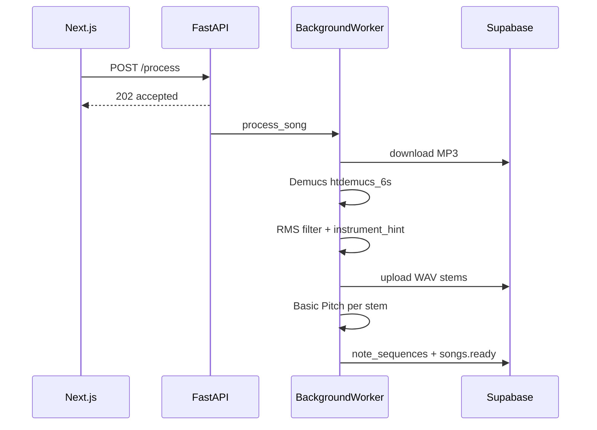

# Cordeband audio processor (Railway)

Python microservice: **Demucs** stem separation, **Basic Pitch** transcription, Supabase Storage + DB updates.

## Endpoints

- `GET /health` — liveness check
- `POST /process` — accepts job, returns immediately; processing runs in background

```json
{
  "song_id": "uuid",
  "storage_path": "originals/{id}.mp3",
  "job_id": "uuid",
  "instrument_hint": ["piano"]
}
```

## Environment

| Variable | Description |
|----------|-------------|
| `SUPABASE_URL` | Project URL |
| `SUPABASE_SERVICE_ROLE_KEY` | Service role key |
| `AUDIO_PROCESSOR_API_KEY` | Bearer token (must match Next.js) |
| `STEMS_BUCKET` | Default `stems` |
| `FEATURED_BUCKET` | Default `featured` (original MP3 for destacadas) |
| `RMS_THRESHOLD` | Default `0.008` |
| `STEMS_TTL_HOURS` | Default `48` (user uploads only) |
| `DEFAULT_BPM` | Fallback `120` if librosa fails |

## Local development (Fase A)

### 1. Python service

**Prerequisite (macOS):** `brew install ffmpeg` — Demucs needs `ffmpeg`/`ffprobe` to decode MP3.

```bash
# From repo root (reads Supabase keys from .env.local):
npm run dev:processor

# Or manually:
cd services/audio-processor
python3 -m venv .venv
source .venv/bin/activate
pip install -r requirements.txt

export SUPABASE_URL="https://YOUR_PROJECT.supabase.co"
export SUPABASE_SERVICE_ROLE_KEY="your-service-role-key"
export AUDIO_PROCESSOR_API_KEY="dev-secret"

uvicorn main:app --reload --host 127.0.0.1 --port 8080
```

First Demucs run downloads ~400MB model.

### 2. Next.js

In `.env.local`:

```env
AUDIO_PROCESSOR_URL=http://127.0.0.1:8080
AUDIO_PROCESSOR_API_KEY=dev-secret
```

Restart `npm run dev`. Without `AUDIO_PROCESSOR_URL`, uploads still use the mock processor.
Keep `npm run dev:processor` running in a second terminal while testing real Demucs locally.

### 3. Test checklist (Glass and Felt, piano-only)

1. Admin → Canciones destacadas → subir MP3, marcar solo **Piano**
2. Job llega a `completed` en la UI
3. `GET /api/songs/{id}/stems` devuelve signed URL del stem piano
4. Player: play audible, mixer mutea piano si es tu instrumento
5. Partitura: notas reales si Basic Pitch instaló; si no, fallback demo hasta instalar deps

## Storage paths

| Tipo | Original (download) | Stems (upload) |
|------|---------------------|----------------|
| Usuario | `stems` / `originals/{id}.mp3` | `stems` / `songs/{id}/stems/{inst}.wav` |
| Destacada | `featured` / `audio/{id}.mp3` | `stems` / `featured/stems/{id}/{inst}.wav` |

## Railway deploy (Fase C)

1. New Railway service from `services/audio-processor/` (uses `Dockerfile`)
2. Set env vars (same as local + production Supabase keys)
3. Allocate **≥4 GB RAM** (Demucs CPU)
4. Copy public URL to Vercel `AUDIO_PROCESSOR_URL`
5. Set matching `AUDIO_PROCESSOR_API_KEY` on Railway and Vercel

## Processing flow


