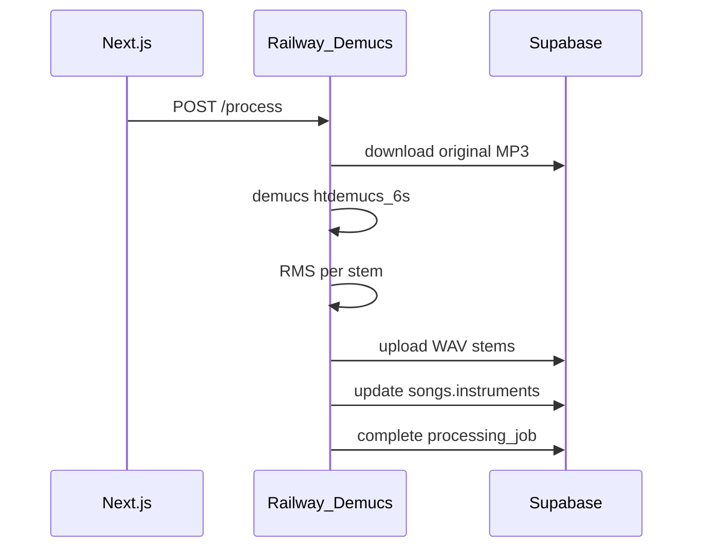

# Cordeband audio processor (Railway)

Python microservice that runs **Demucs** stem separation, uploads WAV stems to Supabase Storage, and updates `processing_jobs` / `songs` in Postgres.

## Endpoints

- `GET /health` — liveness check
- `POST /process` — body:
  ```json
  {
    "song_id": "uuid",
    "storage_path": "originals/{id}.mp3",
    "job_id": "uuid",
    "instrument_hint": ["piano"]
  }
  ```

`instrument_hint` is optional. When provided, Demucs still separates all stems but the service may prioritize those labels; after RMS filtering, `songs.instruments` reflects stems above the energy threshold.

## Environment

| Variable | Description |
|----------|-------------|
| `SUPABASE_URL` | Project URL |
| `SUPABASE_SERVICE_ROLE_KEY` | Service role (upload stems, update rows) |
| `AUDIO_PROCESSOR_API_KEY` | Bearer token expected from Next.js (`AUDIO_PROCESSOR_API_KEY`) |
| `STEMS_BUCKET` | Default `stems` |
| `RMS_THRESHOLD` | Default `0.008` — stems quieter than this are excluded |

## Local dev

```bash
cd services/audio-processor
python -m venv .venv && source .venv/bin/activate
pip install -r requirements.txt
export SUPABASE_URL=... SUPABASE_SERVICE_ROLE_KEY=...
uvicorn main:app --reload --port 8080
```

Point Next.js at it:

```env
AUDIO_PROCESSOR_URL=http://localhost:8080
AUDIO_PROCESSOR_API_KEY=dev-secret
```

## Railway deploy

1. New Railway service from this directory (`Dockerfile` provided).
2. Set env vars above (use Railway secrets).
3. Copy public URL into Vercel `AUDIO_PROCESSOR_URL`.
4. Set matching `AUDIO_PROCESSOR_API_KEY` on both sides.

## Processing flow



## Notes

- GPU recommended for production throughput; CPU works for low volume.
- Validate quality locally before enabling in production (`demucs -n htdemucs_6s` on ~10 tracks).
- Until this service is deployed, Next.js uses `mock-audio-processor` and **manual instrument selection** at upload.
